
# p2-t1-testing-alu0101043845
# Objetivo
El principal objetivo de esta práctica es la tansformación de datos y el uso de pruebas continuas, así como el método de desarrollo BDD ("Behavior-Driven Development")

Se transformarán datos de libros del Project Gutenberg en datos de en nuestro propio formato, esto será posible con el uso de Node.js

Primero crearemos 2 directorios, uno en el que tendremos los datos de los libros (data) y otro donde tendremos loa programas, las pruebas y los datos transformados (database). Esto se puede hacer con el comando "mkdir".

# gulpfile.js
Es un fichero que permite automatizar tareas, el usado por mí es esta práctica es uno bastante simple para la descarga y la extracción de los libros, y es de la siguiente forma:
  var gulp = require('gulp');
  var shell = require('gulp-shell');

  gulp.task("c5-get-guttenberg", shell.task(
	  'cd transforming-data-and-testing-continuously-chapter-5/data && ' + 'curl -O https://www.gutenberg.org/cache/epub/feeds/rdf-     files.tar.bz2 &&' + 'tar -xvjf rdf-files.tar.bz2'
  ));

# Formato de los libros
Para realizar las pruebas usaremos el libro 132, "The Art of War", con el siguiente formato de datos:
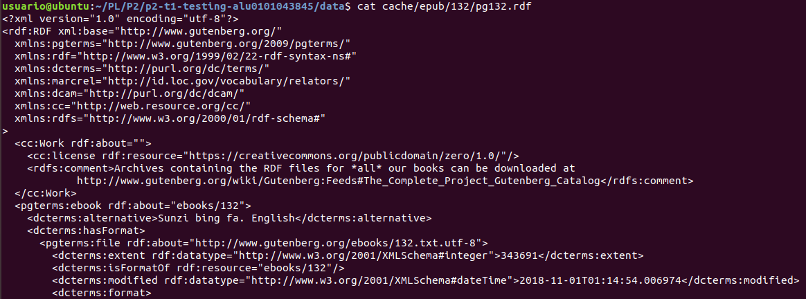
De los cuales queremos conservar el número del libro (132), el título, una lista con los autores y una lista con los temas.

# BDD
BDD es un método basado en tests, con los que hacemos un test para comprobar una funcionalidad de nuestro programa que todavía no hemos implementado, comprobamos que falla, y desarrollamos el mínimo código para que se pase el test, y finalmente repetimos el test para comprobar que se pasa. Para usar estos test usaremos Mocha para el  uso de Unit Tests y Chai, una librería de asersiones.

# Introducción Mocha y Chai
Para instalar Mocha y Chai entraremos es el directorio "databases" y crearemos un paquete mínimo de .json con el comando "npm init -y" y después instalaremos Mocha y Chai.
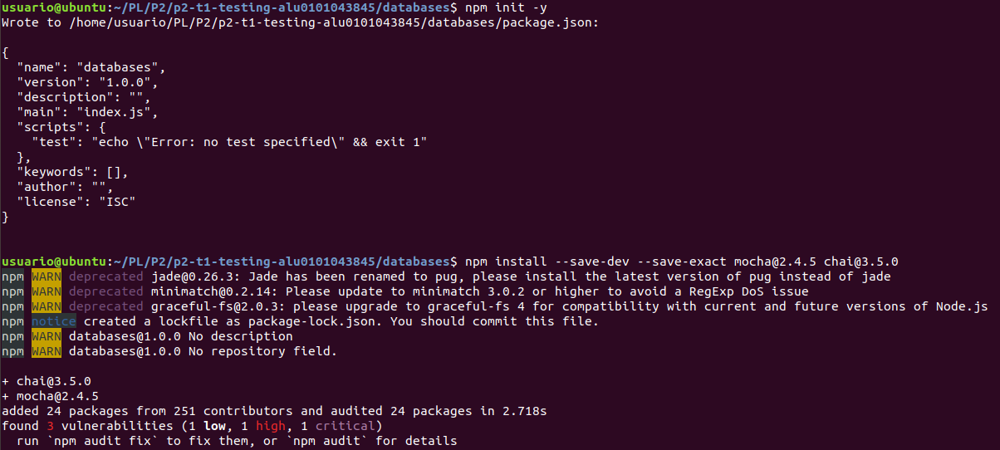
A continuación editaremos el archivo package.json y añadiremos Mocha al uso de tests.
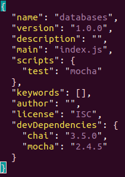
Continuaremos creando un nuevo directorio "test" en el que almacenaremos los tests. Y ejecutaremos el primer test de la siguiente forma:
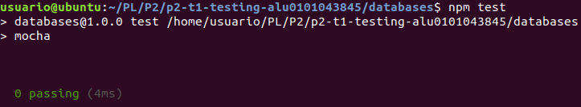
Mostrando 0 passing ya que no hemos creado ninguna prueba.

Ahora crearemos la primera prueba usando "expect()", "describe()" (para agrupar pruebas) y "it()" (pruebas más pequeñas).
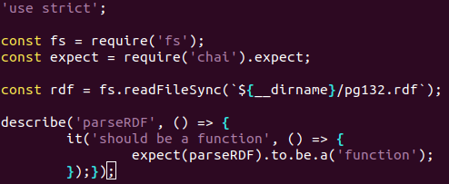
'use strict'; permite que (como indica el nombre) el compilador sea más estricto, como el de java.
Y el "expect()" espera que "parseRDF" sea una función. También copiaremos el libro ("cp ../data/cache/epub/132/pg132.rdf test/") para poder usarlo en las pruebas. Ahora correremos los test y dará error ya que no hemos implementado la función.
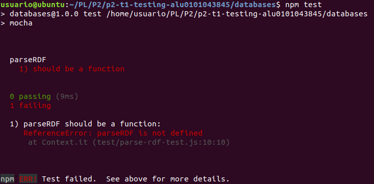

Para implementar la función y que se cumpla el test añadiremos lo siguiente a un nuevo programa llamado "parse-rdf.js" en "databases/lib".
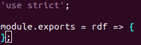
Añadiremos un require del programa que acabamos de crear.
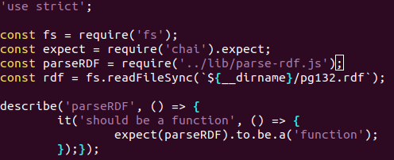

Y ejecutamos el test que esta vez se cumplirá.
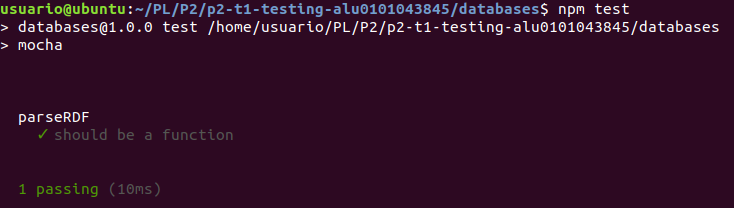

Seguiremos este método de desarrollo test, error, implementación y cumplimiento de test para crear un objeto "book" al que le iremos incluyendo como atributos el id del libro, su título, los autores y los temas de la siguiente forma:
-Prueba:
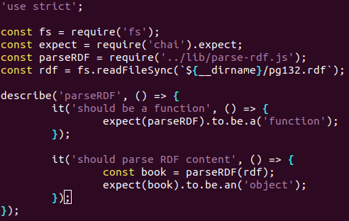
-Error:
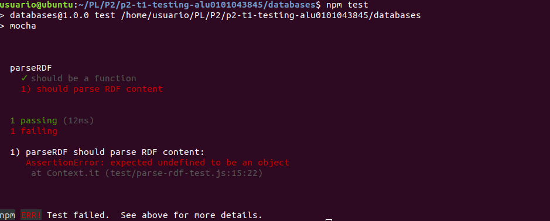
-Implementación:
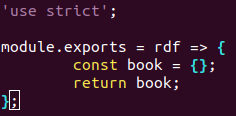
-Éxito:
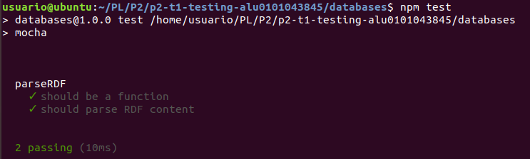

Para realizar un test continuo sin tener que usar el comando npm test cada vez añadiremos una nueva  línea al fichero "package.json":
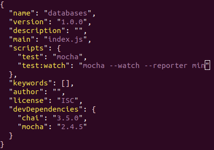

Y usaremos el comando "npm run test:watch" en otra terminal, donde veremos los fallos y aciertos cada vez que se modifiquen los programas o se añadan las pruebas:

# Extracción de datos de un XML usando Cheerio
Primero para usar Cheerio lo tenemos que instalar con "npm install --save --save-exact cheerio@0.22.0"
Ahora crearemos una nueva prueba para comprobar que "book" tiene un atributo "id", que extraeremos con Cheerio.
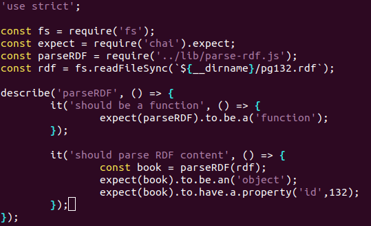
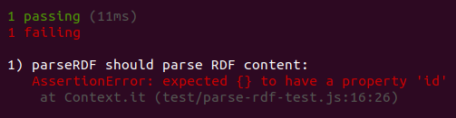

Ahora añadiremos un require de Cheerio y usamos el método"load()" de Cheerio para parsear el contenido rdf y la función $ que su retorno es muy similar al de jQuery. Usando la API de Cheerio, extraeremos el id del libro y lo formatearemos. El "+" nos permite convertir el string en un int, y luego dentro de la etiqueta "pgterms\\:ebook" extraeremos el atributo "rdf:about" y eliminaremos "ebooks/" para quedarnos solo con el número.
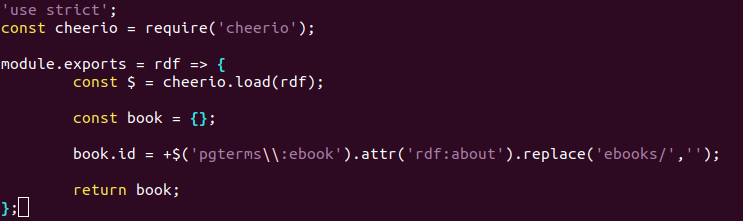

Seguiremos el mismo método para el atributo "title".
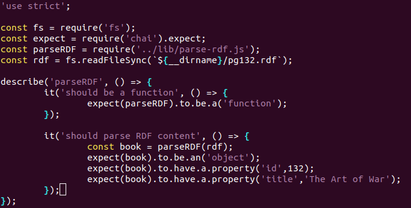

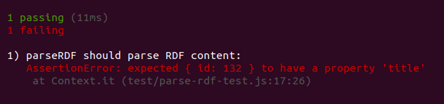

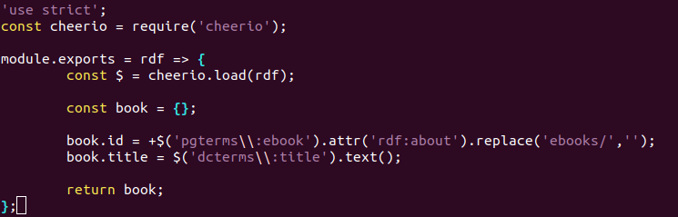

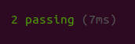

Repetiremos el mismo proceso para los autores y los temas.

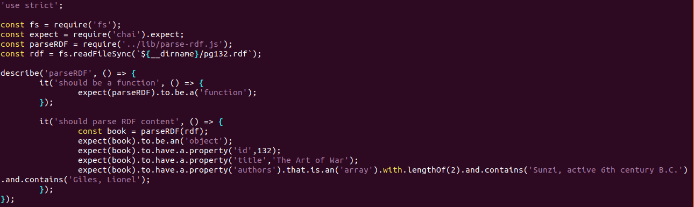
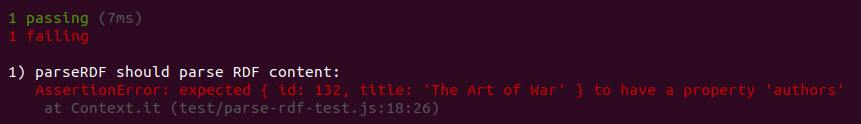
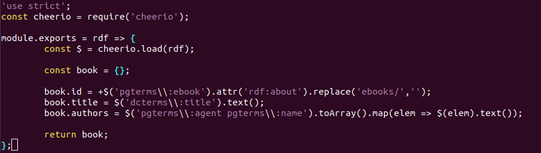
En este paso podemos ver cómo describe el atributo "authors" como un array por el que pasa cada elemento de "pgterms\\:agent pgterms\\:name", parseándolo y agregándolo como texto mediante el uso de map.
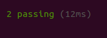

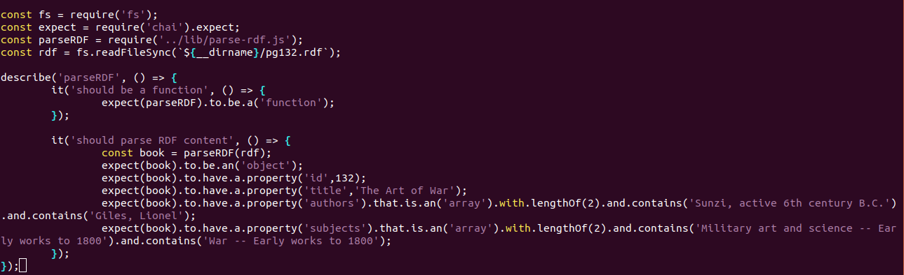
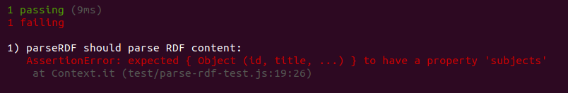
Ahora añadiremos los temas buscando la etiqueta "rdf\\:resource" que sea igual a "LCSH" y subiendo un nivel para acceder a "rdf\\:value" y agregar el elemento al array de temas.
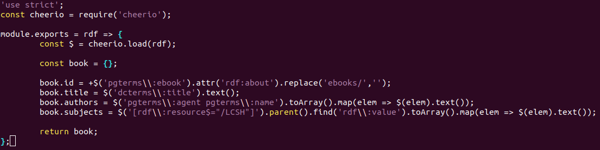

# Ejercicios
Para el primer ejercicio de extracción del código clasificador usaremos el mismo método que con la etiquet a"LCSH" pero ahora con la "LCC".
Y para poder extraer el formato de descarga y el link de descarga crearemos una objeto auxiliar que tendrá los dos atributos arrays y los extraeremos como hemos hecho con anterioridad. Finalmente crearemos un atributo "downloads" y lo igualaremos al objeto que usado antes.
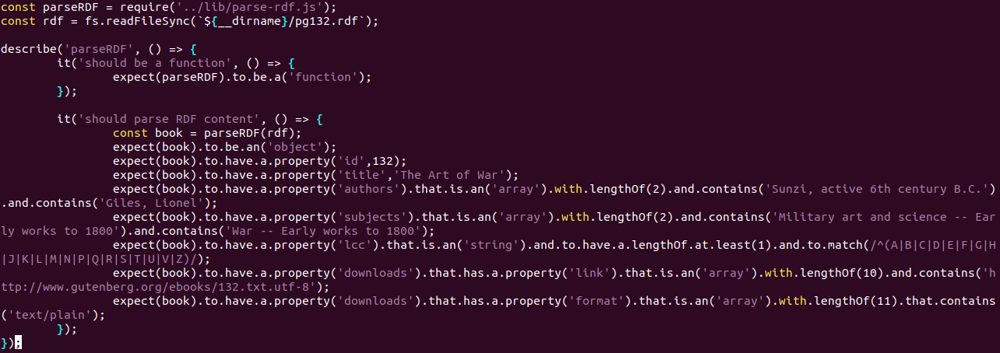
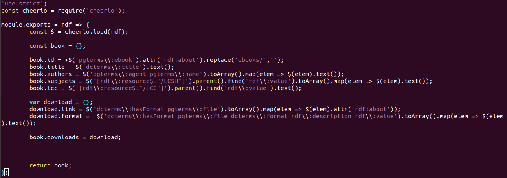
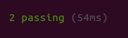
