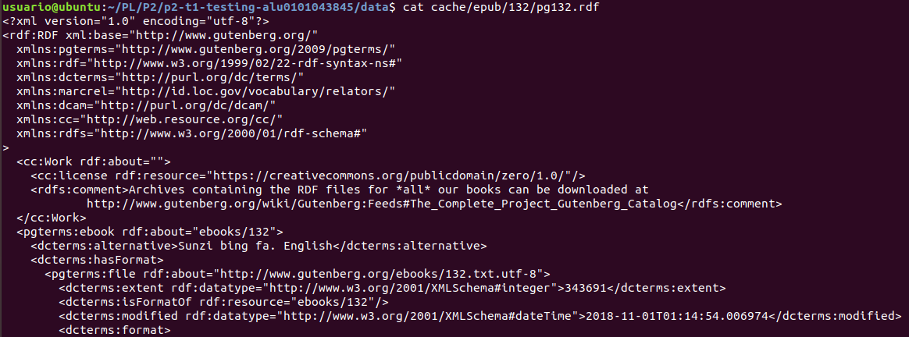
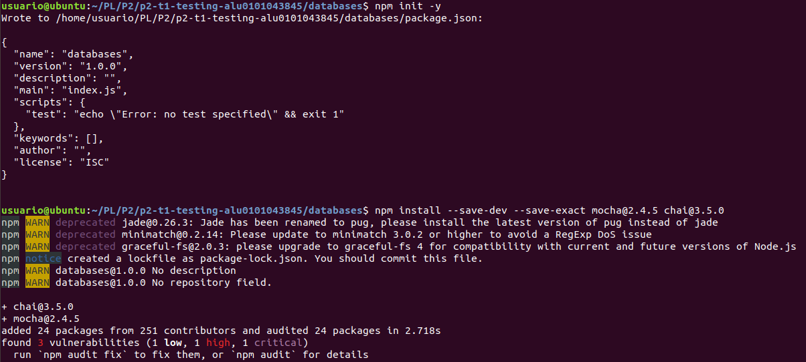

# p2-t1-testing-alu0101043845
# Objetivo
El principal objetivo de esta práctica es la tansformación de datos y el uso de pruebas continuas, así como el método de desarrollo BDD ("Behavior-Driven Development")

Se transformarán datos de libros del Project Gutenberg en datos de en nuestro propio formato, esto será posible con el uso de Node.js

Primero crearemos 2 directorios, uno en el que tendremos los datos de los libros (data) y otro donde tendremos loa programas, las pruebas y los datos transformados (database). Esto se puede hacer con el comando "mkdir".

# gulpfile.js
Es un fichero que permite automatizar tareas, el usado por mí es esta práctica es uno bastante simple para la descarga y la extracción de los libros, y es de la siguiente forma:
  var gulp = require('gulp');
  var shell = require('gulp-shell');

  gulp.task("c5-get-guttenberg", shell.task(
	  'cd transforming-data-and-testing-continuously-chapter-5/data && ' + 'curl -O https://www.gutenberg.org/cache/epub/feeds/rdf-     files.tar.bz2 &&' + 'tar -xvjf rdf-files.tar.bz2'
  ));

# Formato de los libros
Para realizar las pruebas usaremos el libro 132, "The Art of War", con el siguiente formato de datos:

De los cuales queremos conservar el número del libro (132), el título, una lista con los autores y una lista con los temas.

# BDD
BDD es un método basado en tests, con los que hacemos un test para comprobar una funcionalidad de nuestro programa que todavía no hemos implementado, comprobamos que falla, y desarrollamos el mínimo código para que se pase el test, y finalmente repetimos el test para comprobar que se pasa. Para usar estos test usaremos Mocha para el  uso de Unit Tests y Chai, una librería de asersiones.

# Introducción Mocha y Chai
Para instalar Mocha y Chai entraremos es el directorio "databases" y crearemos un paquete mínimo de .json con el comando "npm init -y" y después instalaremos Mocha y Chai.

